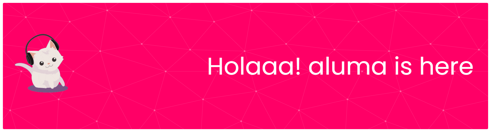

# Coding, Coffee, & Creations ✨

## WELCOMEEE!! in my pages!! 

<!--
**alkusuma05/alkusuma05** is a ✨ _special_ ✨ repository because its `README.md` (this file) appears on your GitHub profile.

Here are some ideas to get you started:

- 🔭 I’m currently working on ...
- 🌱 I’m currently learning ...
- 👯 I’m looking to collaborate on ...
- 🤔 I’m looking for help with ...
- 💬 Ask me about ...
- 📫 How to reach me: ...
- 😄 Pronouns: ...
- ⚡ Fun fact: ...
-->

- I am a student at the University of Muhammadiyah Malang, currently in the early stages of my journey in the world of informatics. As a beginner, I am actively learning a variety of programming languages, including HTML, JavaScript, C, C++, and Python. I am highly motivated and enthusiastic about exploring new concepts, developing my technical skills, and expanding my understanding of computer science and information technology. I enjoy taking on challenges, experimenting with new ideas, and continuously improving myself in this ever-evolving field.

##### yoho my skill

##### connect with me
 

have fun guyss!!!!

